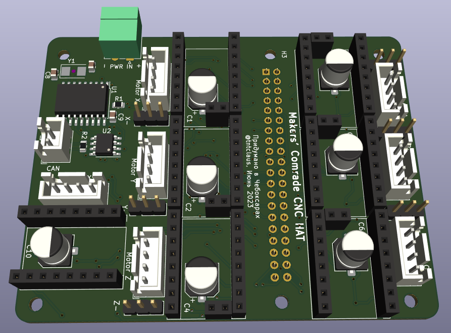

= Makers' Comrade CNC HAT

5/7/8-осевой ЧПУ шилд для Raspberry Pi 3B, 3B+, 4 и другими микрокомпьютерами семейства Pi, с колодкой имеющей 40 gpio  (например, Orange Pi 3B).

== Модели

=== 5-осевой шилд

С независимыми UART линиями, в первую очередь для TMC2208, TMC2209 или для DRV8820, A4988 — обычный режим с конфигурацией через перемычки MS1,MS2,MS3 и других драйвера, поддерживающие DIR/STEP.

xref:kicad/mc_cnc_hat_x5/README.adoc[]

=== 7-осевой шилд с CAN bus

С двумя общими UART линиями и CAN bus контроллером для драйверов TMC2209 или для DRV8820, A4988 — обычный режим с конфигурацией через перемычки MS1,MS2,MS3 и других драйвера, поддерживающие DIR/STEP.

TMC2208 можно установить по 1 на каждую UART линию, при условии что на остальных местах будут драйвера не требующие использования UART (например, DRV8820).

xref:kicad/mc_cnc_hat_x7_canbus/README.adoc[]

=== Общие для всех моделей возможности

* Одновременное управление 5-7 драйверами шаговых двигателей:
** Поддерживаемые драйвера:
*** TMC2209, TMC2208 — режим UART с указанием адреса через перемычки MS1/MS2;
*** DRV8820, A4988 — обычный режим с конфигурацией через перемычки MS1,MS2,MS3;
*** Любые другие драйвера, поддерживающие DIR/STEP.
* Суммарная пиковая производительность всех двигателей 1018 тыс. шагов/секунду (Klipper с патчем, Linux CNC не тестировался, но вероятно будет результат того же порядка).
* Поддержка концевиков для осей X, Y, Z, A, B, C как стандартного типа, так и DIAG выходов для безсенсорной парковки драйвера TMC2209.
* Поддержка дополнительного концевика (например, для датчика наличия/движения филамента 3д принтера).
* Поддерживаемые системы: Linux CNC (не тестировалось), Klipper.

== Инструкция по установке

Инструкция тут: xref:docs/klipper.adoc[]
