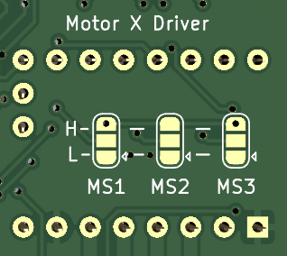

= Настройка драйверов

Каждый драйвер имеет паяемые перемычки MS1/MS2/MS3 для конфигурирования драйвера мотора:

* Если запаять H (3.3V) и центр — будет логическая единица
* Если запаять L (GND) и центр — будет логический ноль

WARNING: Если соединить H и L — будет короткое замыкание. Лучше так не делать.

Они аналогичны джамперам на RAMPS и позволяют в случае с TMC2208 (в режиме без UART) DRV8820, A4988 и аналогичными — задавать микрошаг двигателя.

Для TMC2209 они позволяют задать адрес на линии UART.

Для TMC2208 в режиме UART они бесполезны.
