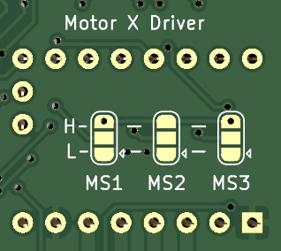

= Maker Comrade's CNC Hat (x7 drivers)

image::../../docs/photo_mc_cnc_hat_x7_canbus.jpeg[]

Шилд для управления двигателями ЧПУ для Raspberry Pi 3B/3B+/4B и Orange Pi 3B (не проверялось, но должно работать).

С двумя общими UART линиями и CAN bus контроллером для драйверов TMC2209 или для DRV8820, A4988 — обычный режим с конфигурацией через перемычки MS1,MS2,MS3 и других драйвера, поддерживающие DIR/STEP.

TMC2208 можно установить по 1 на каждую UART линию, при условии что на остальных местах будут драйвера не требующие использования UART (например, DRV8820).

Первая UART линия общая для X, X1, Y, Z.
Вторая UART линия общая для A, B, C.

== Возможности

* Одновременное управление 7 драйверами шаговых двигателей. Поддерживаемые драйвера:
** TMC2209, TMC2208 — режим UART с указанием адреса через перемычки MS1/MS2;
** DRV8820, A4988 — обычный режим с конфигурацией через перемычки MS1,MS2,MS3;
** Любые другие драйвера, поддерживающие DIR/STEP.
* Суммарная пиковая производительность всех двигателей 1018 тыс. шагов/секунду на RPi 3B+ (Klipper из форка https://github.com/tntclaus/klipper[tntclaus/klipper], Linux CNC не тестировался, но вероятно будет результат того же порядка).
* Поддержка концевиков для осей X, Y, Z, A, B, C как стандартного типа, так и DIAG выходов для безсенсорной парковки драйвера TMC2209.
* Поддержка дополнительного концевика (например, для датчика наличия/движения филамента 3д принтера).
* CANBUS host на базе MCP2515 и трансивера SN65HVD230:
** Даёт возможность гибкого дополнения станка периферией:
*** С контроллером экструдера https://github.com/makerbase-mks/MKS-THR36-THR42-UTC[MKS THR36] можно использовать как 3d принтер (не помешает canbus контроллер нагревательного стола/камеры).
*** С canbus контроллером шпинделя можно использовать как ЧПУ фрезер.
*** ...и т.д.
* Управление PWM нагрузкой с током до 1А (вентилятор обдува, маломощный двигатель).
* Поддерживаемые системы: Linux CNC (не тестировалось), Klipper.

== Использование с Klipper

См. инструкцию xref:../../docs/klipper.adoc[]

== Пины

.Моторы
|===
|Назначение |Motor X |Motor X1 |Motor Y |Motor Z |Motor A |Motor B |Motor C

|STEP
|GPIO3
|GPIO6
|GPIO27
|GPIO19
|GPIO23
|GPIO1
|GPIO20

|DIR
|GPIO2
|GPIO15
|GPIO17
|GPIO13
|GPIO24
|GPIO12
|GPIO21

|UART
|GPIO5
|GPIO5
|GPIO5
|GPIO5
|GPIO25
|GPIO25
|GPIO25

|DIAG/Endstop
|GPIO4
|N/A
|GPIO0
|GPIO26
|GPIO18
|GPIO7
|GPIO16
|===

.CAN bus
|===
|Назначение |GPIO
|CS
|GPIO8

|MOSI
|GPIO10

|MISO
|GPIO9

|SCK
|GPIO11
|===

== Настройка драйверов

Каждый драйвер имеет паяемые перемычки MS1/MS2/MS3 для конфигурирования драйвера мотора:

* Если запаять H (3.3V) и центр — будет логическая единица
* Если запаять L (GND) и центр — будет логический ноль

WARNING: Если соединить H и L — будет короткое замыкание. Лучше так не делать.

Они аналогичны джамперам на RAMPS и позволяют в случае с TMC2208 (в режиме без UART) DRV8820, A4988 и аналогичными — задавать микрошаг двигателя.

Для TMC2209 они позволяют задать адрес на линии UART.

Для TMC2208 в режиме UART они бесполезны.

