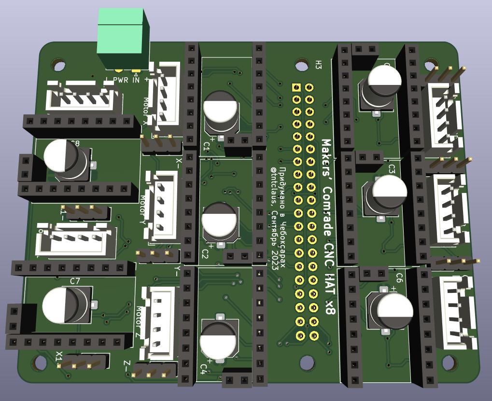

= Makers' Comrade CNC Hat (x8 drivers)

Шилд для управления 8 двигателями ЧПУ для Raspberry Pi 3B/3B+/4B и Orange Pi 3B (не проверялось, но должно работать).

С двумя общими UART линиями для драйверов TMC2209 или для DRV8820, A4988 — обычный режим с конфигурацией через перемычки MS1,MS2,MS3 и других драйвера, поддерживающие DIR/STEP.

TMC2208 можно установить по 1 на каждую UART линию, при условии что на остальных местах будут драйвера не требующие использования UART (например, DRV8820).

Первая UART линия общая для X, X1, Y, Z.
Вторая UART линия общая для A, A1, B, C.

== Возможности

* Одновременное управление 8 драйверами шаговых двигателей. Поддерживаемые драйвера:
** TMC2209 — режим UART с указанием адреса через перемычки MS1/MS2;
** TMC2208, DRV8820, A4988 — обычный режим с конфигурацией через перемычки MS1,MS2,MS3;
** Любые другие драйвера, поддерживающие DIR/STEP.
* Суммарная пиковая производительность всех двигателей 1018 тыс. шагов/секунду на RPi 3B+ (Klipper из форка https://github.com/tntclaus/klipper[tntclaus/klipper], Linux CNC не тестировался, но вероятно будет результат того же порядка).
* Поддержка концевиков для всех двигателей — как стандартного типа, так и DIAG выходов для безсенсорной парковки драйвера TMC2209.
* Поддерживаемые системы: Linux CNC (не тестировалось), Klipper.

== Использование

Для использования с Klipper см. инструкцию xref:../../docs/klipper.adoc[по настройке Klipper]

Конфигурирование драйверов описано в  xref:../../docs/drivers_x7_x8.adoc[инструкции].

== Пины

.Моторы
|===
|Назначение |Motor X |Motor X1 |Motor Y |Motor Z |Motor A |Motor A1 |Motor B |Motor C

|STEP
|GPIO3
|GPIO6
|GPIO27
|GPIO19
|GPIO23
|GPIO9
|GPIO1
|GPIO20

|DIR
|GPIO2
|GPIO15
|GPIO17
|GPIO13
|GPIO24
|GPIO10
|GPIO12
|GPIO21

|UART
|GPIO5
|GPIO5
|GPIO5
|GPIO5
|GPIO25
|GPIO25
|GPIO25
|GPIO25

|DIAG/Endstop
|GPIO4
|GPIO11
|GPIO0
|GPIO26
|GPIO18
|GPIO8
|GPIO7
|GPIO16
|===

